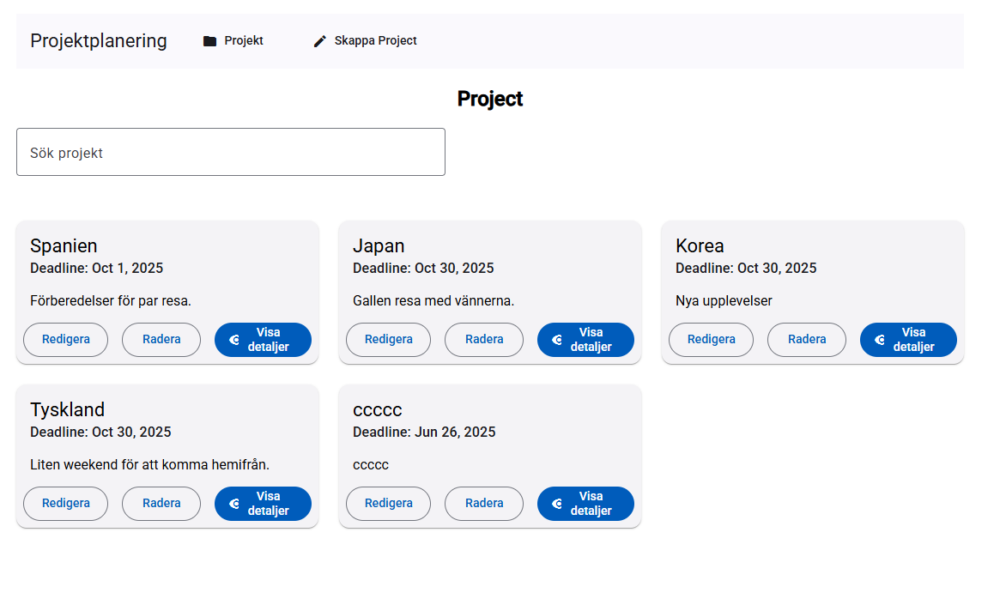
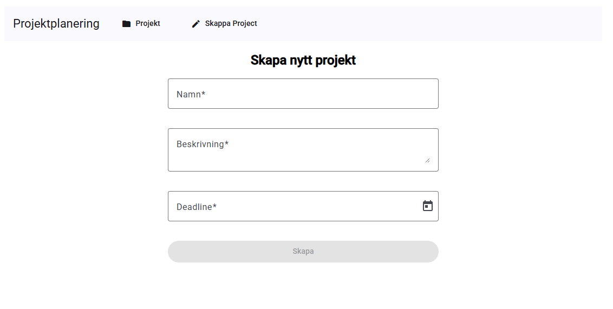
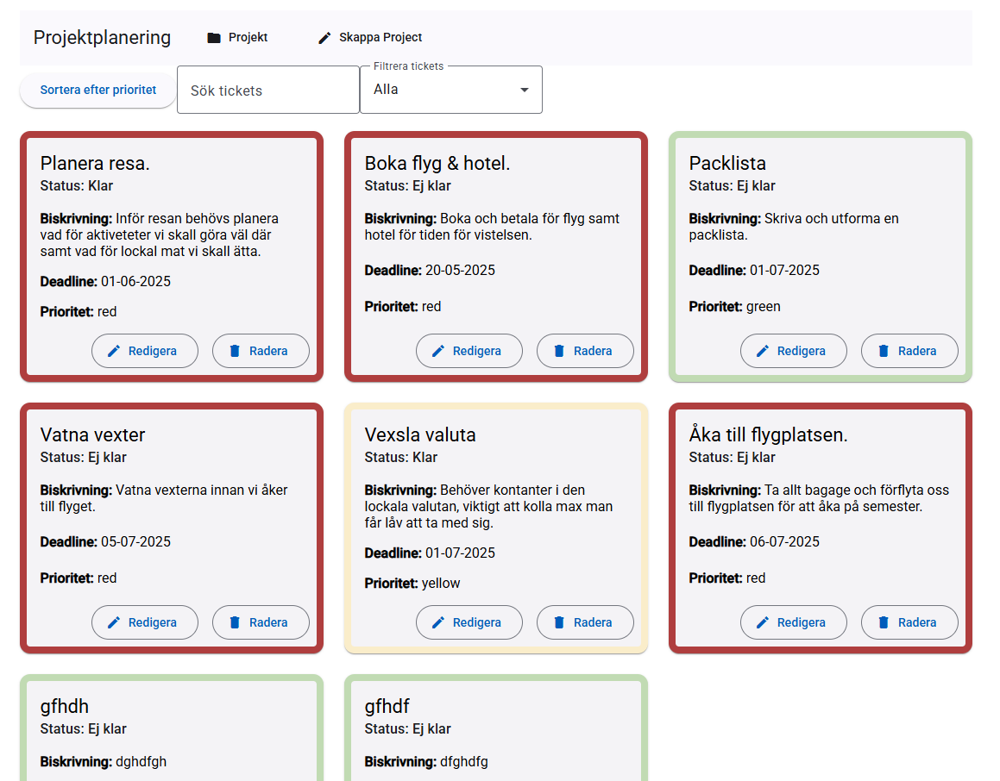

README för JavaScript Avancerat

Installering av Project:
Klona projektet med:
git clone https://github.com/BeatriceOlsson/project_Avanserad_JavaScript_2025

Navigera till projektet med:
cd project_Avanserad_JavaScript_2025

Installera de beroenden som behövs för projektet:
npm install

Starta utvecklingen i en localhost:
ng serve

Öppna sidan i en browser med den givna localhost.

Beskrivning av implementerade funktioner:
Användaren kan skapa både Project och ticket då detta sparas i localStorage. Detta kräver dock att man laddar om sidan för att förändringar skall visas.
De projekt/tickets som är sparade lokalt kan man även uppdatera de, detta kräver också lada om sidan. Går dock inte på data hämtad från DummyDB.
Filtrera Project baserat på titel.
Filtrera tickets baserat på titel och beskrivning samt baserat på status. Även möjligt att få tickets sorterade efter röd, gul och sist grön.

Teknisk dokumentation:
Utvecklat i Angular ^19.2.5, Material UI ^19.2.16 azure-blue, localStorage, Karma ~6.4.0

Reflektioner kring design-beslut och utmaningar:

Då vid första anblick kändes överväldigad valde jag att först fokusera på att få utvecklat och testat de funktionella kraven innan jag gick vidare med utseendet. Detta var både en fördel och en nackdel. Fördelen var att jag fick tid att fundera och få genomgången från skollan angående plug-ins som Angular Matrial UI. nakdelen var att när det väl kom tid till att fokusera på designen av sidan var det inte bara mycket att ha kolla på utan även stressigt med tiden. jag beslutade att följa lärarens rekommendation och använde mig av Angular Matrial UI framför att skriva CSS själv. Detta beslutet tog jag då viste att träna på CSS aldrig är fel ville jag utmana mig med att installera och använda en plug-in. Resultatet blev att jag förstod vad läraren förklarade med för och nackdelar med det och kan därför i framtiden ta ett grundligt beslut till om jag skall skriva CSS själv eller använda t.ex. Angular Matrial UI.

Utmaningar i utvecklingen har varigt att man fått information för sent och trots en välformulerad Project dokumentation kändes det som väldigt mycket att behöver utveckla utan kunskaper. Detta resulterade i att man under utvecklingen behövt vända sig till andra källor för att få svar på hur man utvecklar i Angular. Rent tekniska utmaningar såg jag tidigt att på grund av att vi i nuläget inte kan jobba med en fungerande DB men då kraven kräver att man skall kunna spara, ta bort m.m. beslutade jag tidigt att enda lösningen var att få ett samarbete med DB och localStorage. En annan lösning var att ju mer projektet växte såg man funktioner som kunde och borde skrivas om för att ge mer struktur. Detta resulterade i en hel del arbete från min sida och en del stress.

Skärmdump:

